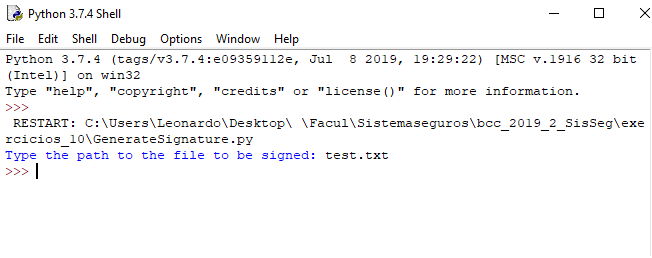

# Execício 10

## Sobre a implementação:
Os itens do trabalho foram implementados utilizando:
- `Python 3.7.4`
- A execução foi realizada através do `Windows cmd`
- Sistema operacional `Windows 10`

O sistema possibilita a criar dois pares de chaves, assinar uma
mensagem, validar a origem do arquivo

## Questão 1

O software é executado a partir do arquivo `GenerateRsaKeys.py` :
Ao executar o arquivo será gerado 4 arquivos contendo as chaves:

## Questão 2
O software é executado a partir do arquivo `GenerateSignature.py` :
Com isso será solicitado o arquivo para assinar:

Após será gerado um arquivo com a assinatura:

## Questão 3 e Questão 4
O software é executado a partir do arquivo `ValidateRsaKeys.py` :
Com isso será solicitado o arquivo para ser validado e a chave para fazer a verificação com assinatura criada e com isso teremos o resultado se a assinatura é valida
Passando a public key do par A(o que foi usado para gerar a assinatura) temos uma assinatura válida

Passando a public key do par B temos o seguinte resultado:

Ou seja como estamos tentando verificar a assinatura com a chave de B a assinatura não é válida
