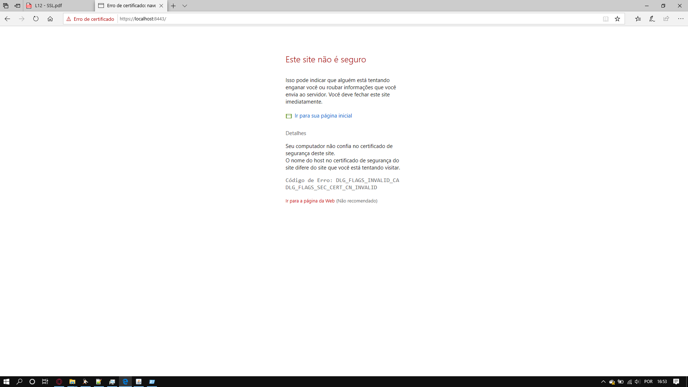
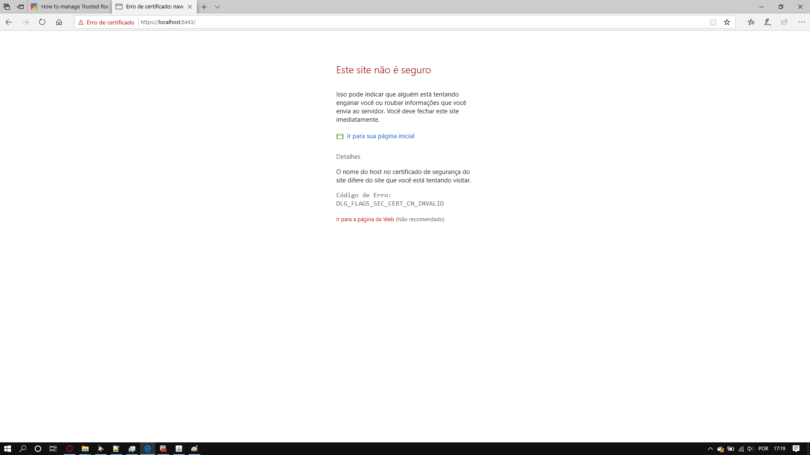
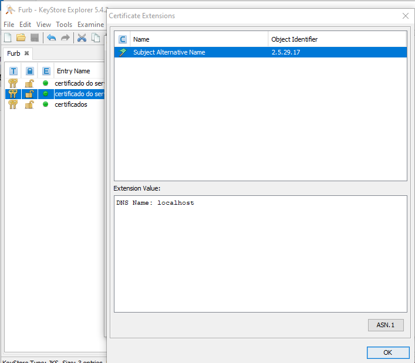
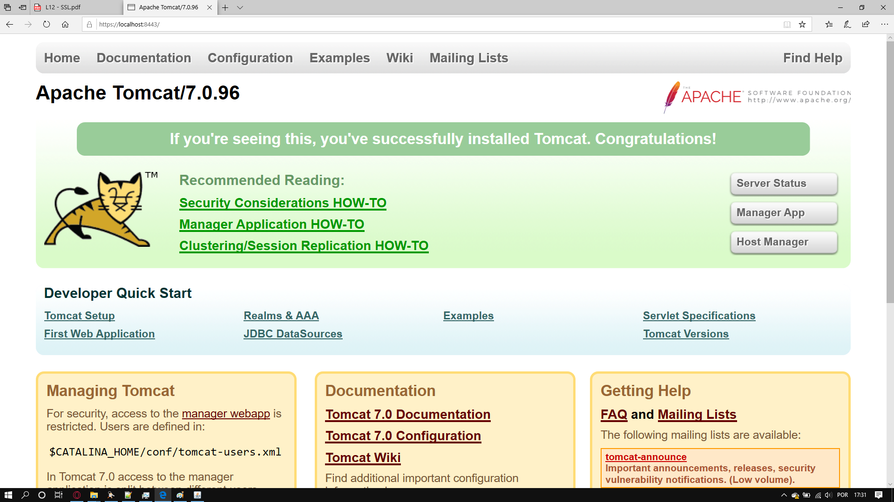

# Execício 12

## Questão 1
Ao tentar acessar o site com o certificado recebemos a segunte mensagem: 

mostrando que o certificado não é confiável

## Questão 2

Após instalar o CA como uma autoridade confiável ainda temos um erro de certificado para resolver:

## Questão 3

Após adicionarmos o "subject alternative name" 

Conseuimos acessar a página:

