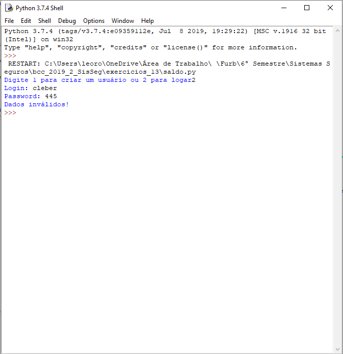

# Exercicio 13
Para realizarmos esse exercício utilizamos a estrutura de tabelas que foi criada em um exercício anterior
que possuí os campos `ds_login`, `ds_senha`, `qt_saldo` nesse exercício utilizaremos apenas os campos de login e senha

## Execução
Ao executarmos o arquivo `saldo.py` teremos a seguinte tela:

Ao selecionarmos a opção '1' poderemos criar um usuário:

Ao selecionarmos a opção '2' poderemos fazer login com o usuário cadastrado:

Caso seja inserido uma senha incorreta será exibido:

## Item 1 
Para fazer a geração do hash utilizamos o algoritmo `Md5`

## Item 2
Como Sal utilizamos as letras impares do login somado a uma constante pré-definada no arquivo com os fontes

## Item 3
Segue imagem dos usuários, os usuários `Rovigo` e `Spiess`

Segue imagem da tabela:

