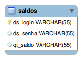
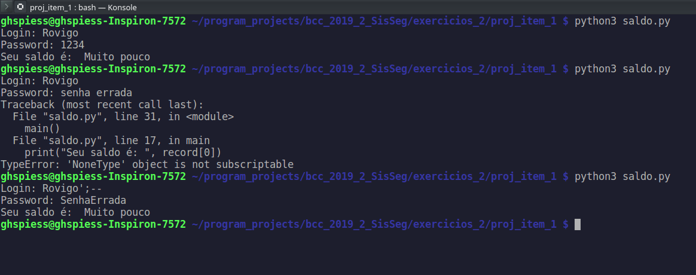
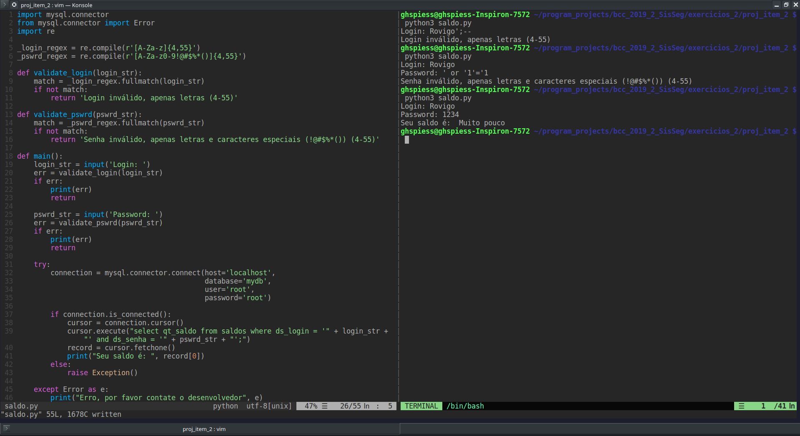
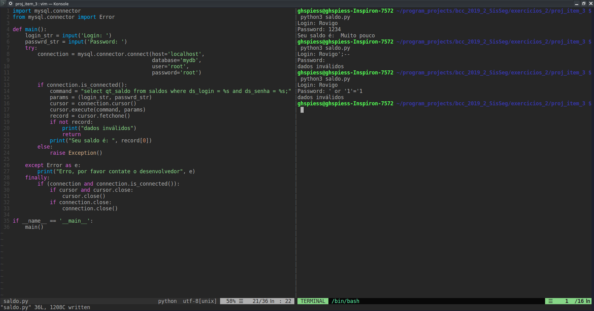

# Execício 02

## Sobre a implementação:
Os itens do trabalho foram implementados utilizando:
- `Python 3.5.2`
- Servidor de banco de dados `Mysql` versão `5.7.26-0ubuntu0.16.04.1 (Ubuntu)`
- A execução foi realizada através dos softwares:
  - `Konsole`, versão `16.04.3`
  - `VIM - VI iMproved 8.1`
- Sistema operacional `Linux Mint KDE`

O sistema simula uma consulta simples a uma aplicação que mantém um registro de
  saldo, um usuário e senha, conforme `MER` a baixo:



## Instalação:

Necessário haver disponível no sistema o `Python` e o gerenciador de pacotes
`pip`. A instalação dos pacotes necessários é feita com os scrips `isntall.sh`
e `install.bat` no diretório de cada item do projeto (necessário executar
apenas uma vez). Nesses diretórios também se encontram os scripts para criação
dos registros e tabelas necessárias à demonstração, bem como o modelo do banco
utilizado.

## Execução:

O software é executado diretamente a partir do terminal, com o comando:

```shell
python3 saldo.py
```

O diretório de execução deve ser um dos diretórios dos itens.

Será solicitado um Login e em seguida uma senha. Um par login e senha válidos
é: `Rovigo`, `1234`. Exemplos de injeção de SQL seriam: Usuário `Rovigo';--`;
Senha `' or '1'='1`;

Os diferentes itens terão comportamentos distintos para casos de exceção.

## Itens:

### Item 1


Foi utilizada a estratégia de SQL injection para fornecer uma consulta alteada.
O trecho de código segue:
```python
  cursor.execute("select qt_saldo from saldos where ds_login = '" + login_str + "' and ds_senha = '" + passwrd_str + "';")
  record = cursor.fetchone()
  print("Seu saldo é: ", record[0])
```

Com a passagem de parâmetros da imagem, a query gerada será:
```SQL
select qt_saldo from saldos where ds_login = 'Rovigo';--' and ds_senha = '';
```

Dessa forma, a consulta era realizada sem a validação da senha, o que
representa uma falha na segurança.

### Item 2


Nesse caso, foi realizada a validação por meio de `white list`, isso é, se os
parâmetros não estivessem adequadamente informados, não respeitando o que era
pedido, não é possível executar o SQL.

O código da validação segue:
```python
def validate_login(login_str):
    match = _login_regex.fullmatch(login_str)
    if not match:
        return 'Login inválido, apenas letras (4-55)'

def validate_pswrd(pswrd_str):
    match = _pswrd_regex.fullmatch(pswrd_str)
    if not match:
        return 'Senha inválido, apenas letras e caracteres especiais (!@#$%*()) (4-55)'

def main():
    login_str = input('Login: ')
    err = validate_login(login_str)
    if err:
        print(err)
        return

    pswrd_str = input('Password: ')
    err = validate_pswrd(pswrd_str)
    if err:
        print(err)
        return

    ...

```

Dessa forma, se o usuário tentar informar algum valor que não se enquadre
estritamente no que é solicitado, não sendo a descrição adequada de uma senha
e/ou de um login, o processo é descontinuado. 

A passagem dos parâmetros errados resulta em uma mensagem:
```shell
> Login inválido, apenas letras (4-55)
```

Ou

```shell
> Senha inválido, apenas letras e caracteres especiais (!@#$%*()) (4-55)
```

### Item 3


Neste último caso, é realizada a consulta com parâmetros. Isso é, os valores
informados pelo usuário são sanitarizados antes de serem executados na base de
dados.

A validação é feita com o seguinte trecho de código:
```python
command = "select qt_saldo from saldos where ds_login = %s and ds_senha = %s;"
params = (login_str, passwrd_str)
cursor = connection.cursor()
cursor.execute(command, params)
record = cursor.fetchone()
if not record:
    print("dados inválidos")
    return
print("Seu saldo é: ", record[0])
```

Dessa forma, ao inserir os dados maliciosos, será executada a consulta:

```SQL
select qt_saldo from saldos where ds_login = 'Rovigo'';--' and ds_senha = '';
```

Or

```SQL
select qt_saldo from saldos where ds_login = 'Rovigo' and ds_senha = ''' or ''1=''1';
```

