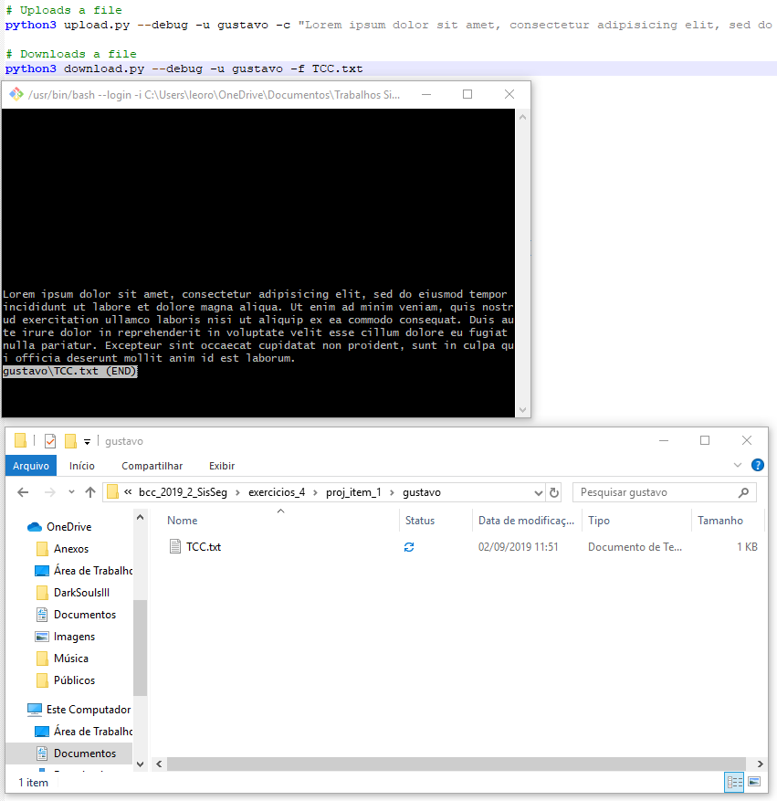
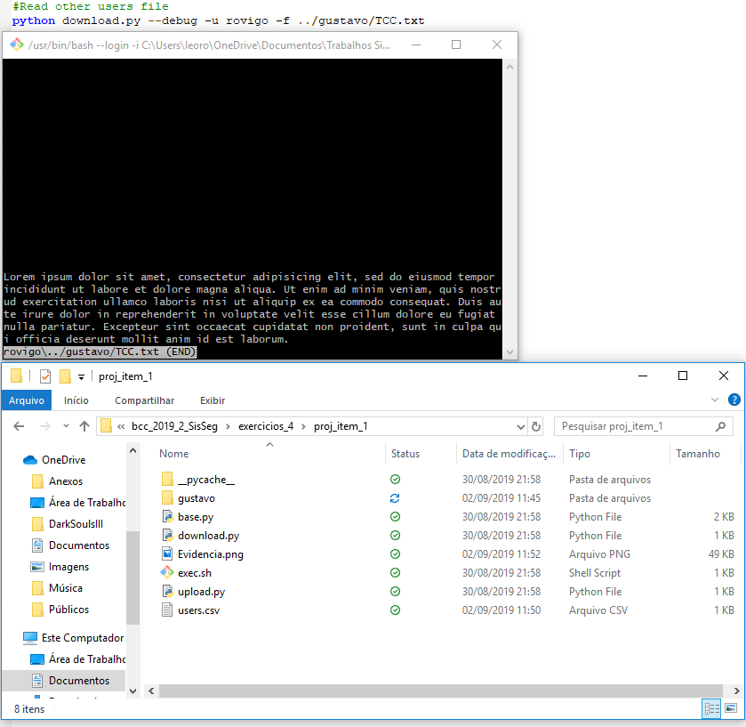
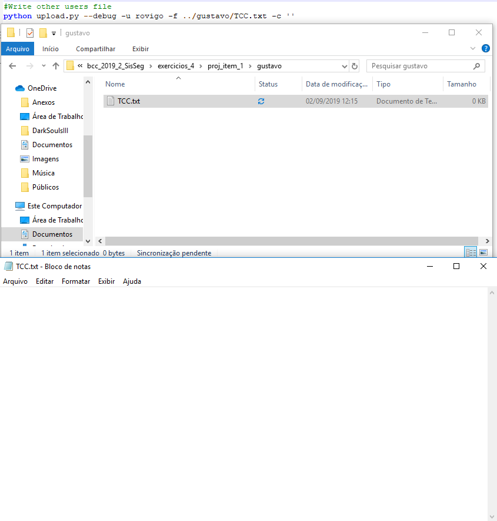
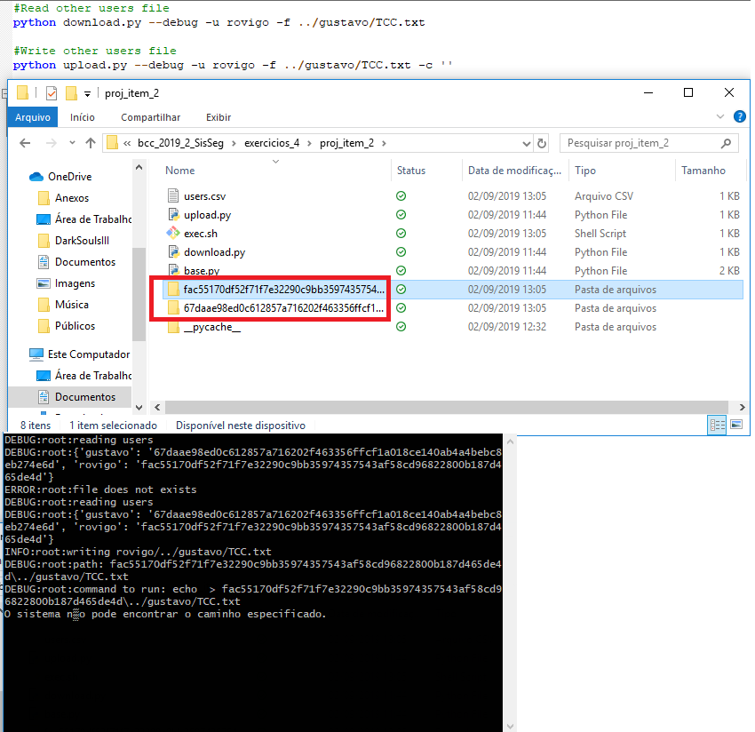

# Execício 04

## Sobre a implementação:
Os itens do trabalho foram implementados utilizando:
- `Python 3.7.4`
- A execução foi realizada através do `Windows cmd`
- Sistema operacional `Windows 10`

O sistema possibilita a usuários fazerem upload e download de arquivos para pastas onde cada
usuário possui sua própria pasta.

## Execução:

O software é executado diretamente a partir do terminal, com os comandos:

```shell
python3 upload.py
```

```shell
python3 download.py
```

O diretório de execução deve ser um dos diretórios dos itens.

Ao ser feito o upload será solicitado um nome de arquivo a adicionar e um usuario e ao ser 
feito o download será solicitado o arquivo a ser baixado e um usuario. Durante o download o 
exemplo de Path Transversal seria: "File:" `../gustavo/TCC.txt` e "Usuario:"`rovigo`. Se 
informado um nome válido, o usuario `rovigo` acessará a pasta do usuário `gustavo` e irá 
ler o arquivo dele e na hora do upload passamos as entradas: "File:" `../gustavo/TCC.txt`,
 "Usuario:"`rovigo` e "Conteudo:" ` ` assim apagando todo o arquivo do usuário `gustavo`.

Os diferentes itens terão comportamentos distintos para casos de exceção.

## Itens:

### Item 1


Aqui temos o funcionamento padrão onde o usuário `gustavo` criou seu arquivo `TCC.txt`



Foi utilizado o caminho `../gustavo/TCC.txt` para que o usuário `rovigo` conseguisse ler
o arquivo.
Devido ao seguinte trecho de código:
Arquivo: `download.py`
```Python
path = os.path.join(user_name, file_path)
```
Com a passagem de parâmetros para o metodo `os.path.join()`, será concatenado o usuário 
com o caminho para que o usuário possa baixar apenas seus arquivos.
Porem ao ser utilizado `../gustavo/TCC.txt` o usuário está navegando para fora de sua pasta
e entrando na pasta do outro usuário podendo ler o seu arquivo.



Nessa imagem temos o usuário `rovigo` apagando o conteúdo do arquivo do usuário `gustavo`
Trecho do codigo:
Arquivo: `upload.py`

```Python
path = os.path.join(user_name, file_path)
```
Com essa passagem de parametros o resultado será o mesmo comentado acima, o usuário irá
navegar para fora de sua pasta


### Item 2


Nesse caso, foi colocado um hash para cada usuário através da `hashlib` assim ao usuário 
tentar informar: `../gustavo/TCC.txt`, não será um caminho existente pois a pasta do 
usuário não está com o seu nome mas sim com um hash.
Segue a baixo o código e sua explicação

Aqui carregamos os usuários que já estão no arquivo .csv para o nosso `user_map` 
caso o usuário especificado como entrada para o programa não exista, adicionamos
ele no csv e no map com os pares de `user_name` e `sha` que seriam o nome do usuário e o
hash. 
```python
    def load_users(user_name):
    logging.debug('reading users')
    user_map = dict()
    with open('users.csv', newline='') as users_file:
        user_reader = csv.reader(users_file, **default_csv_param)
        for user in user_reader:
            user_map[user[0]] = user[1]

    logging.debug(user_map)

    if user_name not in user_map:
        logging.debug('%s does not exists' % user_name)
        sha = add_user(user_name)
        user_map[user_name] = sha

    return user_map
```

Ao adicionarmos o usuário no csv, no método `add_user(user_name)`, temos o seguinte código 
que irá gerar um hash, com base no nome de usuário:

```python
sha = hashlib.sha256(user_name.encode('utf-8')).hexdigest()
```

Dessa forma, se o usuário tentar informar algum valor que tente acessar a pastas
de outro usuário ele irá receber a mensagem: 

```shell
> O sistema não pode encontrar o caminho especificado
```
