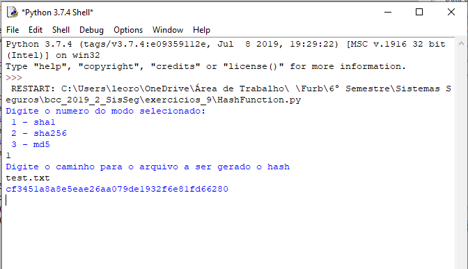
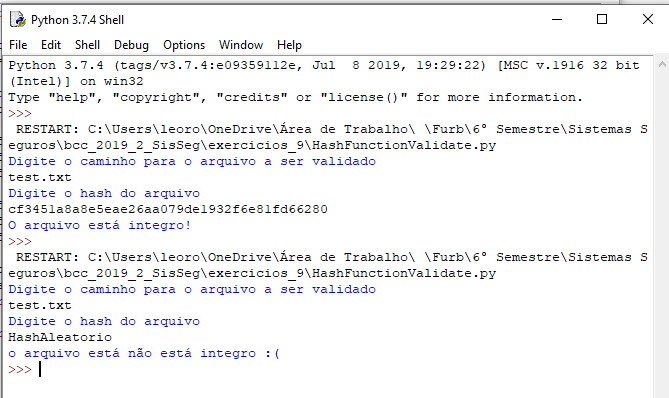

# Execício 09

## Sobre a implementação:
Os itens do trabalho foram implementados utilizando:
- `Python 3.7.4`
- A execução foi realizada através do `Windows cmd`
- Sistema operacional `Windows 10`

O sistema possibilita a gerar o hash do conteúdo de um arquivo a partir.

## Questão 1

O software é executado a partir do arquivo `HashFunction.py` :
Segue resultado da execução:

## Questão 2
O software é executado a partir do arquivo `HashFunctionValidate.py` :
Segue resultado da execução:

